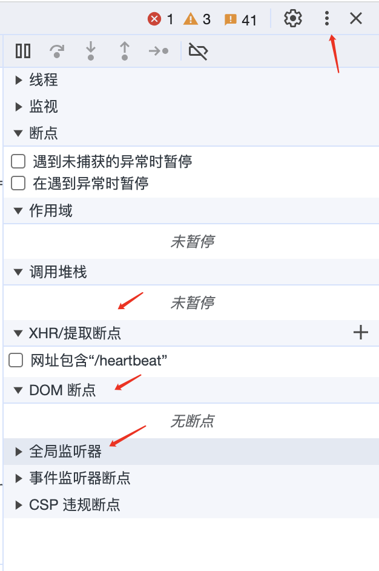
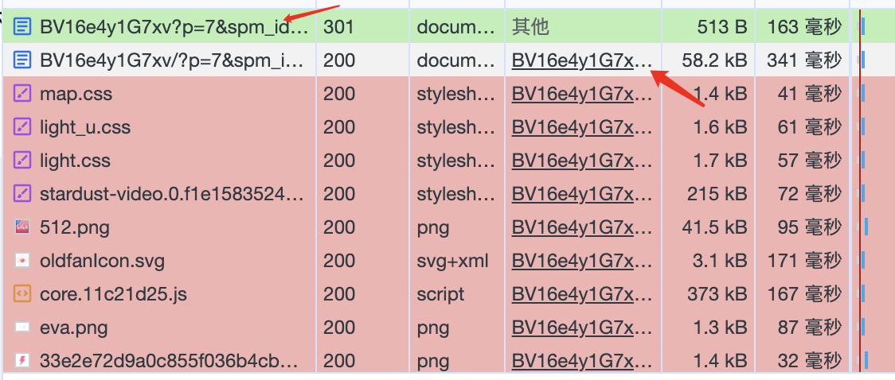

## 快捷键

`commond+w`：关闭当前页面

`commond+1 to 8`： 切换到对应序号的浏览器标签

`commond+shift+T`：打开被关闭的页面

`commond+shift+J`：打开下载

`commond+shift+N`：打开新的无痕页面

<!--more-->

`commond+shift+F`：浏览器全屏

`commond+shift+D`：切换调试控制台位置

`commond+shift+P`：打开命令commond面板

`commond+option+I`：打开调试控制台位置

`commond+option+（左右键）`：跳到左边/右边分页

`commond+[` `commond+]`：左右切换调试工具面板

`command+R`：刷新页面

`command+L`：输入网址

`space` `shift+space`：向下滚动、向上滚动

## 元素

`选中元素，按h`：快速隐藏元素

`选中元素，commond+⬆` `commond+⬇`：上下移动DOM

## 控制台

`$0` `$1` `$2` `$3` `$4`：元素面板选中元素/上1、2、3、4个

`copy`：复制任意对象到剪贴板

`$` `$$`：$代表document.querySelector $$代表document.querySelectorAll

`点击小眼睛`：实时监控表达式的值

`$x`：获取xPath的值

## 源代码

断点调试的五个按钮：

1. 恢复执行。运行到下个断点 
2. 执行下一行的任何操作，并跳转到下一行 
3. 进入函数内部，如果下一行包含一个函数调用，讲进入该函数，并在该函数第一行暂停。
4. 跳出函数，执行当前函数剩余部分，在函数调用下一个语句暂停
5. 暂时禁用所有断点，不删除断点

三个小圆点：可选源代码全局搜索选项，

DOM断点在元素面板选中元素右键也可操作。

## 网络

1. 开始抓取网络请求
2. 清除抓取记录
3. 关闭过滤面板
4. 打开检索面板
5. 跨页面加载保存请求
6. 禁用浏览器缓存
7. 慢速网络模拟
8. 过滤面板，按住commond可以同时选取多个过滤，过滤器中可以设置多个规则，scheme/set-cookie-domain/status-code等

在网络请求列表中，点击启动器可以定位到源代码。按住shift可以看到该请求的依赖者

