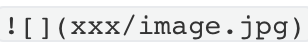
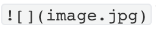

# Hexo中插入图片

1. 安装图片插件`hexo-renderer-marked`

   ```sh
   npm install hexo-renderer-marked --save
   ```

2. **根目录**的`_config.yml`文件中配置：

   ```yaml
   post_asset_folder: true
   marked:
     prependRoot: true
     postAsset: true
   ```

   

3. 创建文章，此时会在`source/_posts`生成同名文件夹，放置文章资源

   ```sh
   hexo n "xxx"
   ```

   

4. 配置Typora

   打开typora的偏好设置，点击图像，更改为如下设置

   

5. 图片引入

   **注意**：在typora中图片引入的格式：（引入第六步的插件以后，typora图片格式的文字不能显示了）

   

   在hexo中图片引入的格式：

   

6. 安装插件`hexo-image-link`解决typora与hexo路径不一致问题，这样在typora和hexo都可以显示图片了

   ```sh
   npm install hexo-image-link --save
   ```

   

   
