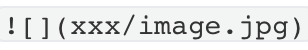
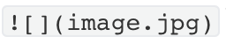
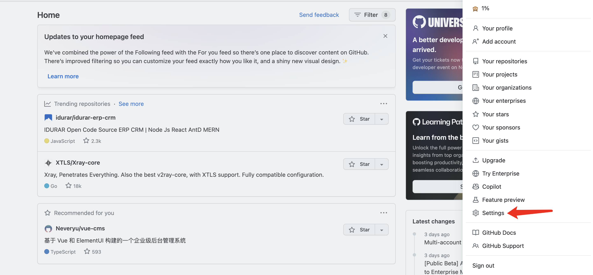
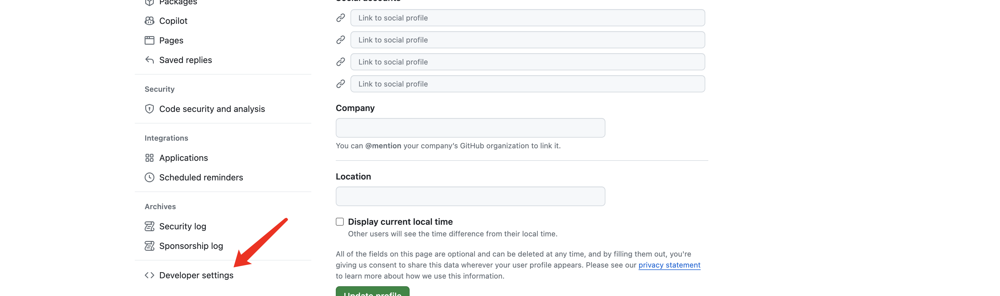
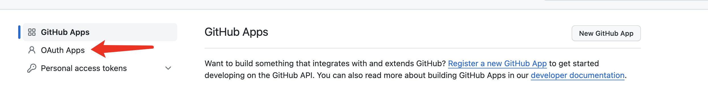
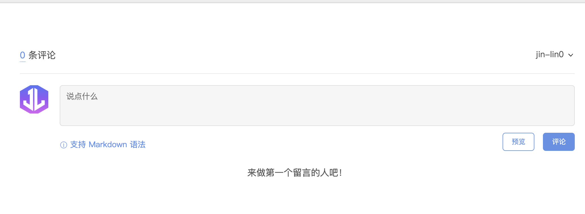
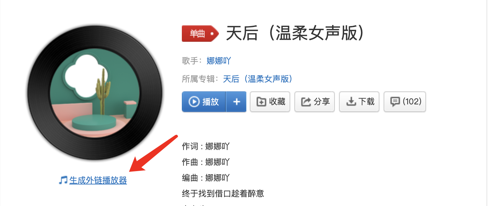
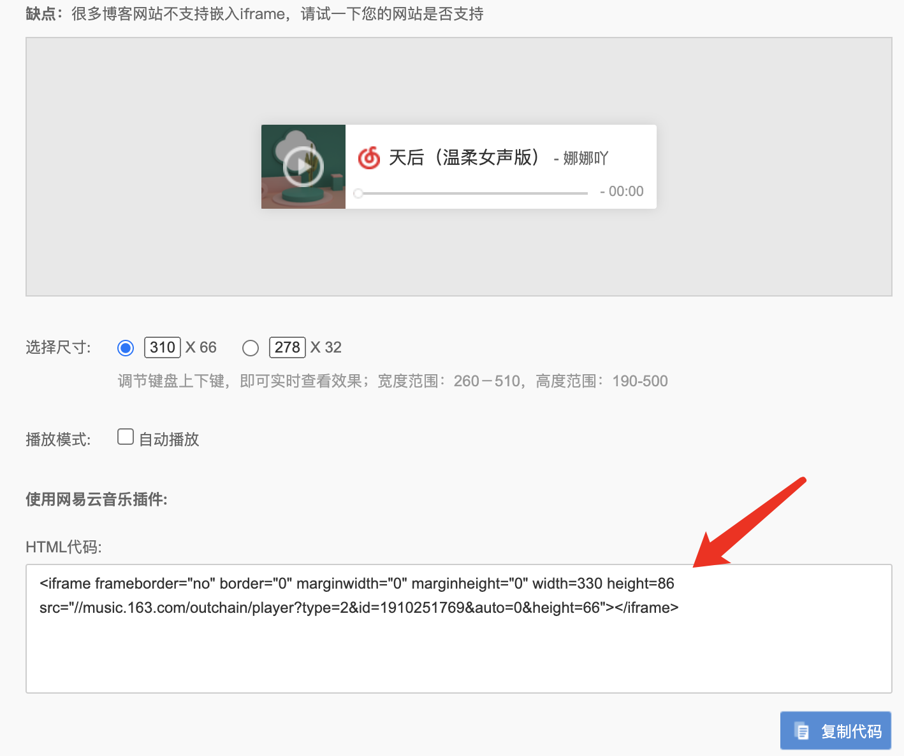

## Hexo中插入图片

1. 安装图片插件`hexo-renderer-marked`

   ```sh
   npm install hexo-renderer-marked --save
   ```

   <!--more-->

2. **根目录**的`_config.yml`文件中配置：

   ```yaml
   post_asset_folder: true
   marked:
     prependRoot: true
     postAsset: true
   ```

3. 创建文章，此时会在`source/_posts`生成同名文件夹，放置文章资源

   ```sh
   hexo n "xxx"
   ```

4. 配置Typora

   打开typora的偏好设置，点击图像，更改为如下设置

   

5. 图片引入

   **注意**：在typora中图片引入的格式：（引入第六步的插件以后，typora图片格式的文字不能显示了）

   

   在hexo中图片引入的格式：

   

6. 安装插件`hexo-image-link`解决typora与hexo路径不一致问题，这样在typora和hexo都可以显示图片了

   ```sh
   npm install hexo-image-link --save
   ```


## Hexo-Next支持数学公式

1. 卸载原有渲染器`hexo-renderer-marked`，安装`hexo-renderer-kramed`

   ```sh
   npm uninstall hexo-renderer-marked
   npm install hexo-renderer-kramed
   ```

2. 配置Next的`_config.yml`文件

   ```yaml
   math:
     # Default (true) will load mathjax / katex script on demand.
     # That is it only render those page which has `mathjax: true` in Front-matter.
     # If you set it to false, it will load mathjax / katex srcipt EVERY PAGE.
     per_page: true
   
     # hexo-renderer-pandoc (or hexo-renderer-kramed) required for full MathJax support.
     mathjax:
       enable: true
       # See: https://mhchem.github.io/MathJax-mhchem/
       mhchem: false
   
     # hexo-renderer-markdown-it-plus (or hexo-renderer-markdown-it with markdown-it-katex plugin) required for full Katex support.
     katex:
       enable: false
       # See: https://github.com/KaTeX/KaTeX/tree/master/contrib/copy-tex
       copy_tex: false
   ```

3. 解决语义冲突

   取消反斜杠`\\`和下划线`_`的转义，`/node_modules/kramed/lib/rules/inline.js`修改如下：

   ```javascript
   //escape: /^\\([\\`*{}\[\]()#$+\-.!_>])/,
   escape: /^\\([`*\[\]()#$+\-.!_>])/, //第11行
     
   //em: /^\b_((?:__|[\s\S])+?)_\b|^\*((?:\*\*|[\s\S])+?)\*(?!\*)/,
   em: /^\*((?:\*\*|[\s\S])+?)\*(?!\*)/, //第20行
   ```

4. 在需要使用LaTeX渲染的博文中，在文章的Front-matter里打开mathjax开关：

   ```yaml
   mathjax: true
   ```

5. 使用

   - 行内公式

     ```latex
     $lim_{1\to+\infty}P(|\sum_i^nX_i-\mu|<\epsilon)=1, i=1,...,n$
     ```

     $lim_{1\to+\infty}P(|\sum_i^nX_i-\mu|<\epsilon)=1, i=1,...,n$

   - 行间公式

     ```latex
     $$lim_{1\to+\infty}P(|\sum_i^nX_i-\mu|<\epsilon)=1, i=1,...,n$$
     ```

     $$lim_{1\to+\infty}P(|\sum_i^nX_i-\mu|<\epsilon)=1, i=1,...,n$$

   - 公式编号

     ```latex
     \begin{align}
     a+b\\
     b+c\\
     a+c\\
     \end{align}
     \label(52)
     ```

     \begin{align}
     a+b\\
     b+c\\
     a+c\\
     \end{align}

## Hexo生成唯一永久文章链接

hexo的文章链接默认的生成规则是：`:year/:month/:day/:title`，标题如果是中文，会变得特别冗长。同时修改标题后文章链接会发生变化，URL层级深，不利于SEO，因此安装如下插件。

1. 安装`hexo-abbrlink`

   ```sh
   npm i hexo-abbrlink --save
   ```

2. 修改**根目录**的`_config.yml`配置：(`posts/`可以舍去)

   ```yaml
   permalink: posts/:abbrlink/
   ```

3. 清除hexo缓存

   ```sh
   hexo clean
   ```

## Hexo文章添加评论

1. 登录Github，点击右侧头像，点击**Setting**选项

   

2. 左侧菜单选择**Developer setting**，进入开发者页面

   

3. 选择OAuth创建应用

   

4. 设置应用的相关信息

   - Application name 应用名称
   - Homepage URL 博客主页
   - Authorization callback URL 授权回调页面（同 Homepage URL）

   

   

5. 保存 **Client ID** 和 **Client secrets**

6. 配置主题`_config.yml`文件

   ```yaml
   gitalk:
     enable: true
     github_id: jin-lin0 # GitHub repo owner
     repo: jin-lin0.github.io # Repository name to store issues
     client_id: xxx # GitHub Application Client ID
     client_secret: xxx # GitHub Application Client Secret
     admin_user: jin-lin0 # GitHub repo owner and collaborators, only these guys can initialize gitHub issues
     distraction_free_mode: true # Facebook-like distraction free mode
     # Gitalk's display language depends on user's browser or system environment
     # If you want everyone visiting your site to see a uniform language, you can set a force language value
     # Available values: en | es-ES | fr | ru | zh-CN | zh-TW
     language: zh-CN
   ```

   - 设置`enable`为`true`
   - `github_id`填入`github`帐号
   - `repo`填入`github`仓库名（**仓库名不是仓库地址**），评论以`issues`形式保存在该仓库下
   - `client_id`填入注册生成的值
   - `client_secret`填入注册生成的值
   - `admin_user`填入`github`帐号，初始化评论账户

7. 隐藏评论功能，在front matter中添加：

   ```yaml
   comments: false
   ```

8. Github登录后访问文章，即可自动初始化gitalk的issues，成功添加后效果如下：

   

## Hexo字数统计与阅读时长

1. **根目录**安装插件`hexo-symbols-count-time`

   ```sh
   npm install hexo-symbols-count-time --save
   ```

2. **根目录**配置`_config.yml`，如果中文较多`awl`采用2，否则默认即可

   ```yaml
   symbols_count_time:
     symbols: true
     time: true
     total_symbols: true
     total_time: true
     exclude_codeblock: false
     awl: 2
     wpm: 300
     suffix: "mins."
   ```

   `symbols`：字数统计

   `time`：时间统计

   `total_symbols`：总字数统计

   `total_time`：总时间统计

   `exclude_codeblock`：排除代码块计算

3. **主题**配置`_config.yml`

   ```yaml
   symbols_count_time:
     separated_meta: true
     item_text_post: true
     item_text_total: true
   ```

   `separated_meta`：是否和发表时间不在一行

   `item_text_post`：文章前面是否显示文字描述（本文字数，统计时长）

   `item_text_total`：页面底部显示站点总字数，总时长

4. 清除hexo缓存

   ```
   hexo clean
   ```

   

## Hexo中插入背景音乐

1. 网易云音乐中点击生成外链链接

   

2. 复制外链iframe到`/next/layout/macro/sidebar.swig`中即可

   
