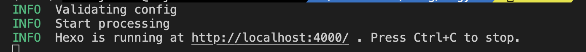

# Hexo搭建站点

[hexo官方网站](https://hexo.io/index.html)

## 准备

1. Github新建仓库，命名为 `{username}.github.io`
2. 安装[Node.js](https://nodejs.org/en/download)，安装Stable版本。
3. 安装Hexo-cli，即Hexo的命令行工具。

   ```sh
   npm install -g hexo-cli
   ```

<!--more-->

## 初始化

1. 创建项目，进入创建的文件夹

   ```shell
   hexo init {name}
   cd {name}
   ```
2. 启动项目

   ```sh
   hexo server
   ```

   显示如下界面，浏览器打开 `http://localhost:4000/`查看博客站点

   
3. 编译部署项目

   修改根目录的 `_config.yml`文件，修改Deployment部分为新建仓库的地址，修改分支为master

   ```yaml
   deploy:
     type: "git"
     repo: "git@github.com:xxx/xxx.github.io.git"
     branch: master
   ```

   安装git部署插件 `hexo-deployer-git`

   ```sh
   npm install hexo-deployer-git --save
   ```

   根目录创建文件 `deploy.sh`，内容如下：

   ```
   hexo clean
   
   hexo generate
   
   hexo deploy
   ```

   控制台输入 `sh deploy.sh`，编译部署项目，Hexo会把编译后的静态内容上传到 `master`分支
4. Github新建 `source`分支放置源码

   ```
   git init
   git checkout -b source
   git add -A
   git commit -m "init blog"
   git remote add origin git@github.com:{username}/{username}.github.io.git
   git push origin source
   ```

## 主站配置

1. 修改 `_config.yml`文件

   ```yaml
   # Site
   title: MY BLOG
   subtitle: ""
   description: ""
   keywords: Javascript
   author: HJL
   language: zh-CN
   timezone: ""
   ```

## 主题配置-Next

1. 下载Next源码到Themes文件夹中

   ```sh
   git clone https://github.com/theme-next/hexo-theme-next themes/next
   ```
   
2. **根目录**下 `_config.yml` 文件，修改 `theme`字段

   ```yaml
   theme: next
   ```
   
3. **themes/next**目录下 `_config.yml` 文件

   - 布局样式：scheme，选择一种取消注释：

     ```yaml
     # scheme: Muse
     #scheme: Mist
     scheme: Pisces
     #scheme: Gemini
     ```
     
   - Favicon: [图片转为图标网站](https://realfavicongenerator.net/)，图标下载后放置在 ` themes/next/source/images`文件夹，并配置favicon：
   
     ```yaml
     favicon:
       small: /images/favicon-16x16.png
       medium: /images/favicon-32x32.png
       apple_touch_icon: /images/apple-touch-icon.png
       safari_pinned_tab: /images/safari-pinned-tab.svg
       #android_manifest: /images/manifest.json
       ms_browserconfig: /images/browserconfig.xml
     ```
     
   - 头像：avatar，` themes/next/source/images`文件夹中放置 `avatar.png`作为图像，rounded配置圆形，rotated配置hover旋转：
   
     ```yaml
     avatar:
       # Replace the default image and set the url here.
       # url: #/images/avatar.gif
       url: /images/avatar.png
       # If true, the avatar will be dispalyed in circle.
       rounded: false
       # If true, the avatar will be rotated with the cursor.
       rotated: true
     ```
     
   - Back2top：快速返回文章顶部，`enable`开启，`sidebar`配置侧边栏，`scrollpercent`配置阅读百分比：
   
     ```yaml
     back2top:
       enable: true
       # Back to top in sidebar.
       sidebar: false
       # Scroll percent label in b2t button.
       scrollpercent: true
     ```
     
   - Reading_progress：显示阅读进度，上方显示进度条：
   
     ```yaml
     reading_progress:
       enable: true
       # Available values: top | bottom
       position: top
       color: "#37c6c0"
       height: 3px
     ```
     
   - Github_banner：页面右上角跳转到Github仓库
   
     ```yaml
     github_banner:
       enable: true
       permalink: https://github.com/xxx
       title: Follow me on GitHub
     ```
     
   - Local_search：搜索功能

     安装插件 `hexo-generator-searchdb`：

     ```sh
     npm install hexo-generator-searchdb --save
     ```
   
     **根目录**的 `_config.yml`文件配置搜索：
   
     ```yaml
     search:
       path: search.xml
       field: post
       content: true
       format: html
       limit: 10000
     ```
   
     **themes/next目录下**的 `_config.yml`文件配置搜索：
   
     ```yaml
     local_search:
       enable: true
       # If auto, trigger search by changing input.
       # If manual, trigger search by pressing enter key or search button.
       trigger: auto
       # Show top n results per article, show all results by setting to -1
       top_n_per_article: 1
       # Unescape html strings to the readable one.
       unescape: false
       # Preload the search data when the page loads.
       preload: false
     ```
     
   - Custom_file_path：自定义文件路径，例如，在**根目录** `source/_data`创建 `styles.styl`文件，在该文件自定义修改网站的css：
   
     ```yaml
     custom_file_path:
       #head: source/_data/head.swig
       #header: source/_data/header.swig
       #sidebar: source/_data/sidebar.swig
       #postMeta: source/_data/post-meta.swig
       #postBodyEnd: source/_data/post-body-end.swig
       #footer: source/_data/footer.swig
       #bodyEnd: source/_data/body-end.swig
       #variable: source/_data/variables.styl
       #mixin: source/_data/mixins.styl
       style: source/_data/styles.styl
     ```
     
   - powered：去掉footer中Hexo与Next强力驱动文字
   
     ```yaml
       # Powered by Hexo & NexT
       powered: false
     ```
     
   - busuanzi_count：不蒜子访客统计
   
     ```yaml
     busuanzi_count:
       enable: true
       total_visitors: true
       total_visitors_icon: fa fa-user
       total_views: true
       total_views_icon: fa fa-eye
       post_views: true
       post_views_icon: fa fa-eye
     ```
   
   ## 新建内容
   
   1. 新建文章：创建的文章在目录 `source/_posts`文件夹下，MarkDown格式
   
      ```sh
         hexo new xxx
      ```
   
         文章开头采用如下格式添加信息：
   
      ```yaml
         title: Hexo构建
         date: 2023-11-04 20:01:20
         tags: 
         -Hexo
         categories:
         -Hexo
      ```
   
      检查Next主题的`_config.yml`中简介设置打开：(默认安装时打开)
   
      ```yaml
      # Automatically excerpt description in homepage as preamble text.
      excerpt_description: true
      ```
   
      在文章中添加截断，只有截断之前的内容才会在列表页展示
   
      ```markdown
      <!--more-->
      ```
   
   2. 新建分类：
   
      新建分类页面，生成 `/source/categories/index.md`文件
      
      ```
      hexo new page categories
      ```
   
      Front Matter中添加 `type: categories`
      
      ```
      title: categories
      date: 2023-11-06 17:21:15
      type: "categories"
      comments: false
      ```
      
      创建文章的Front Matter中设置分类
      
      - 一级分类
      
        ```yaml
        categories: 
        - FE
        ```
      
      - 二级分类
   
        ```yaml
        categories: 
        - FE
        - CSS
        ```
      
   2. 新建标签
   
      新建标签页，生成 `/source/tags/index.md`文件
      
      ```sh
      hexo new page tags
      ```
   
      Front Matter中添加 `type: tags`:
      
      ```
      title: tags
      date: 2023-11-04 15:45:29
      type: "tags"
      comments: false
      ```
      
      修改**主题**的 `_config.yml`文件，配置Tags和categories
      
      ```yaml
      menu:
        home: / || fa fa-home
        #about: /about/ || fa fa-user
        tags: /tags/ || fa fa-tags
        categories: /categories/ || fa fa-th
        archives: /archives/ || fa fa-archive
        #schedule: /schedule/ || fa fa-calendar
        #sitemap: /sitemap.xml || fa fa-sitemap
        #commonweal: /404/ || fa fa-heartbeat
      ```
      
      清除无用的标签：
      
      ```sh
      hexo clean
      ```
   
   
