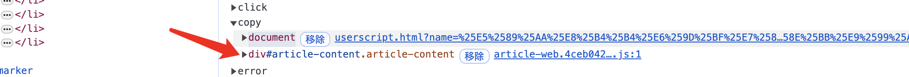
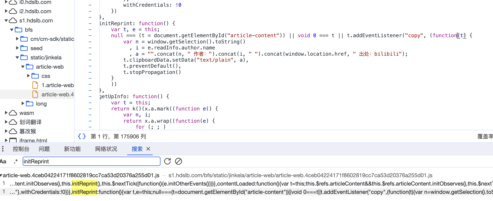

在对网页的内容复制的时候，开发者往往对用户的剪贴板复制的内容进行一些限制，比如在知乎复制的时候，超过一定的文字复制内容，剪贴板会被自动添加以下内容：

> 作者：xxx
> 链接：https://www.zhihu.com/question/xxx
> 来源：知乎
> 著作权归作者所有。商业转载请联系作者获得授权，非商业转载请注明出处。

本脚本可以对文字类内容的冗余信息进行去除，重写了复制监听函数，已测试可以通过大多数网站。

该脚本的下载链接：[剪贴板版权信息去除](https://greasyfork.org/zh-CN/scripts/475881-%E5%89%AA%E8%B4%B4%E6%9D%BF%E7%89%88%E6%9D%83%E4%BF%A1%E6%81%AF%E5%8E%BB%E9%99%A4)

<!--more-->

这里在应用Bilibili阅读的时候，可以看到我们的脚本是挂载在document上的，而网页源代码对copy的监听是挂载在dom节点上的，copy事件默认从dom节点向上冒泡，直到document上



打开网页源代码，发现在重写copy事件的时候，bilibili使用`t.stopProgagation()`将进一步冒泡取消掉了，所以我们的copy监听事件在冒泡中不会被触发



使用相同的思路，我们设置在捕获过程中对copy事件进行触发，然后使用`e.stopPropagation();`阻断后续copy事件的冒泡即可，`document.addEventListener`中第三个参数是useCapture，即为捕获阶段触发，同时我们使用`e.stopPropagation()`进行事件的进一步捕获。

完整代码：

```javascript
(function () {
  function getCopiedContent() {
    const selection = window.getSelection();
    const range = selection.getRangeAt(0);
    const container = document.createElement("div");
    container.appendChild(range.cloneContents());
    return {
      text: range.toString(),
      html: container.innerHTML,
    };
  }

  document.addEventListener(
    "copy",
    function (e) {
      const copiedContent = getCopiedContent();
      if (copiedContent.text) {
        let clipboardData = e.clipboardData || window.clipboardData;
        clipboardData.setData("text/plain", copiedContent.text);
        clipboardData.setData("text/html", copiedContent.html);
        e.preventDefault();
        e.stopPropagation();
      }
    },
    true
  );
})();
```

