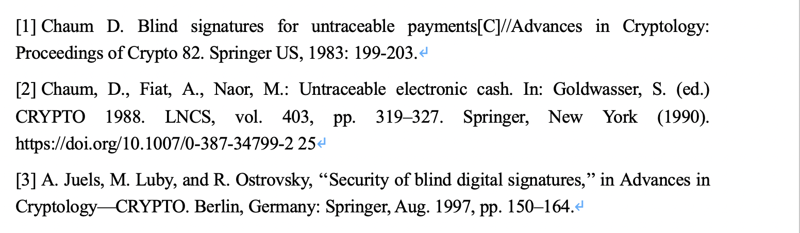
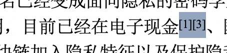
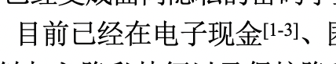

Word中实现连续多个参考文献的引用，如xxx<sup><a href="#xxx">[1-4]</a></sup>

<!--more-->

1. 首先将参考文献自动编号

   

2. 光标移到需要引用的位置，选择【引用】-【交叉引用】，插入需要引用文献编号的首位和末位，然后点击【开始】选择$X^2$

   

3. 选中右键选择**切换域代码**，得到下面的代码

   ```mathematica
   {REF _Ref153957510 \r \h  \* MERGEFORMAT }{REF _Ref153996683 \r \h  \* MERGEFORMAT }
   ```

   修改上面的代码如下，右键选择**更新域**即可实现

   ```mathematica
   {REF _Ref153957510 \r \h \#"[0" \* MERGEFORMAT }-{REF _Ref153996683 \r \h \#"0]" \* MERGEFORMAT }
   ```

   

