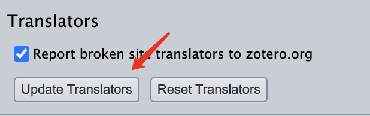

## [茉莉花插件](https://github.com/l0o0/jasminum?tab=readme-ov-file)

[茉莉花插件](https://github.com/l0o0/jasminum?tab=readme-ov-file)是一个star超过4.3k的zotero中文插件，支持：

1. 中文期刊附件（PDF/CAJ）的元数据抓取，支持添加PDF/CAJ时自动抓取元数据功能
2. 集成 Zotero 中文社区转换器的下载与更新功能
3. 为知网学位论文PDF添加章节书签（依赖于PDFtk）
4. 更新中文文献引用次数，核心期刊信息
5. 合并/拆分姓，名，识别文献条目语言，下载知网附件，统一日期格式等

<!--more-->

### 安装

1. 安装PDFtk

   [点我[Intel MacOS(>10.15)]>](https://www.pdflabs.com/tools/pdftk-the-pdf-toolkit/pdftk_server-2.02-mac_osx-10.11-setup.pkg)下载

2. 下载xpi文件

   下载最新的[xpi](https://github.com/l0o0/jasminum/releases/latest)文件（Firefox浏览器用户记住右键另存为），打开 Zotero -> 工具 -> 插件 -> 右上小齿轮图标 -> Install Add-on From File ... -> 选择下载好的xpi文件。

3. 更新Zotero Connect

   右键选择浏览器插件的Zotero Connect插件，选择选项->Advanced->Update Translators可以抓取知网的full text了

   

4. 重启Zotero

## [Zotero-shortdoi](https://github.com/bwiernik/zotero-shortdoi)

使用CrossRef API自动获取期刊文章的doi并使用[http://shortdoi.org](http://shortdoi.org/)查找短 DOI 名称，支持

1. 获取短DOI：对于所选项目，查找短DOI（替换存储的DOI，如果有）并标记无效DOI。
2. 获取长 DOI：对于所选项目，查找完整 DOI（替换存储的 DOI，如果有）并标记无效 DOI。
3. 验证和清理 DOI：对于选定的项目，查找完整的 DOI（替换存储的 DOI，如果有），验证存储的 DOI 是否有效，并标记无效的 DOI。
   - 此功能还会从 DOI 字段中删除不必要的前缀（例如`doi:`、或发布商 URL 前缀）。`https://doi.org/`

### 安装

1. [下载并导入xpi文件](https://github.com/bwiernik/zotero-shortdoi/releases/latest)

2. 修改sci-hub为默认pdf解释器

   - 编辑----首选项----高级----设置编辑器

   - 点击I accept the risk！搜索extensions.zotero.findPDFs.resolvers

   - 修改值为：

   ```json
   {
       "name":"Sci-Hub",
       "method":"GET",
       "url":"https://sci-hub.se/{doi}",
       "mode":"html",
       "selector":"#pdf",
       "attribute":"src",
       "automatic":true
   }
   ```

   
