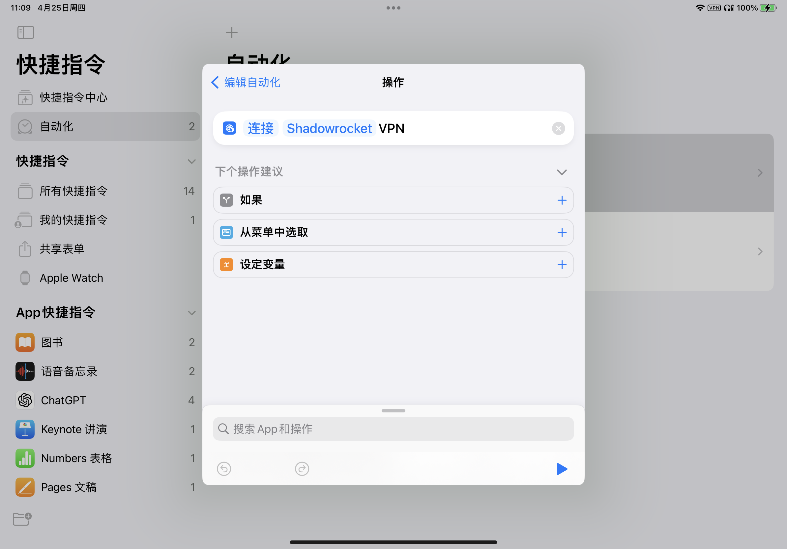

在使用iPad或者iPhone的软件与服务中，有些软件需要使用VPN，有些软件需要暂时关闭VPN能实现更快的响应速度。发现了一个之前没有使用过的应用叫 **快捷指令** 可以有效解决全部手动打开/关闭VPN的问题。

<!--more-->

## 操作步骤

1. 打开手机的快捷指令软件，打开自动化，点击创建个人自动化

   

2. 选择当启用app的时候执行连接/断开连接VPN即可，然后关闭运行前询问，点击执行（ps：iphone没有找到设定vpn选项）

   
